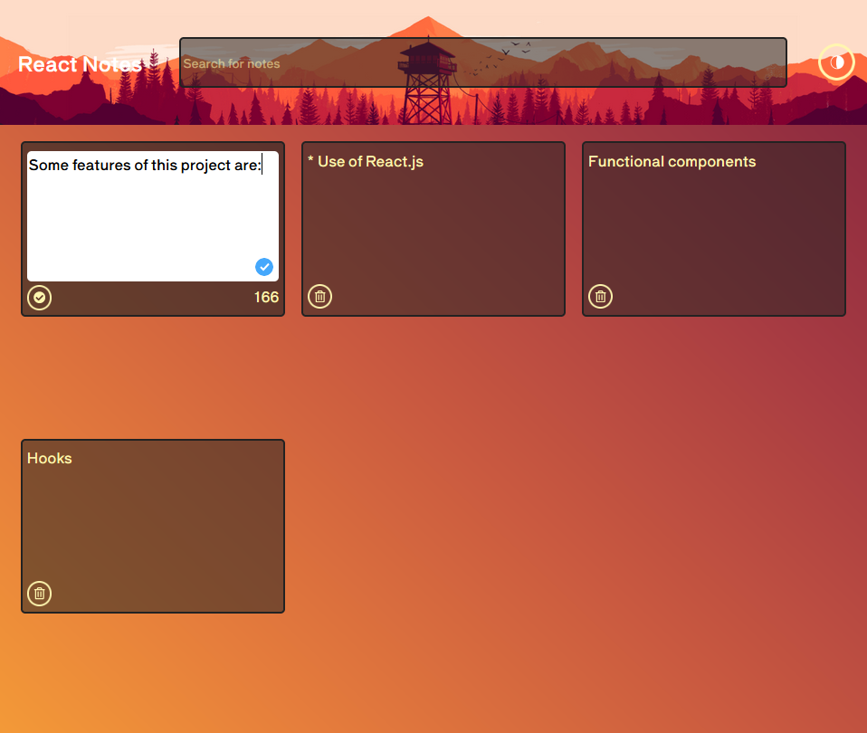
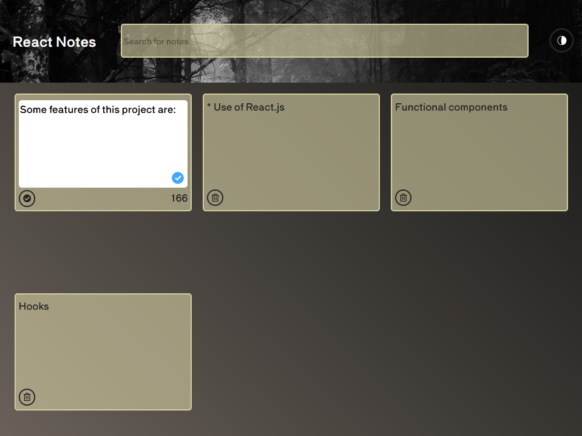
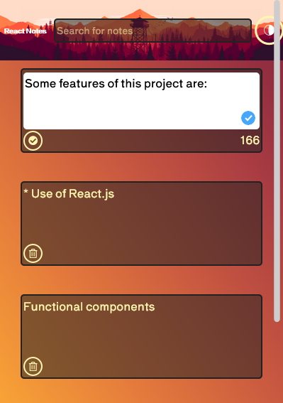

# **My first React project ->** [Click here to go to React Notes](http://localhost:3000/React-Notes)

> In this project, I created a version of a to-do list using React

Some of the features of this project are: 

* Use of React.Js
* Functional components
* Hooks
* Use of local storage

## Desktop 

## Dark Theme 

## Mobile 

[Link to the website](http://localhost:3000/React-Notes)

